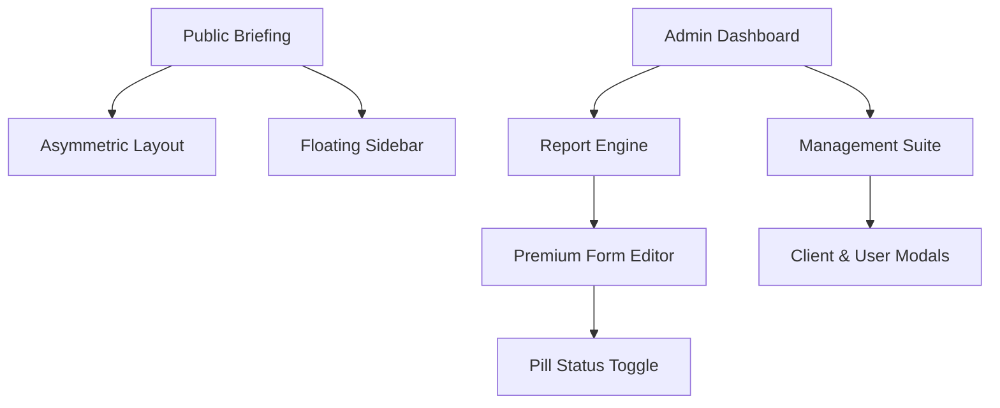

# AKOM (Intelligence Reporting System) — Dark Premium Edition

[](https://laravel.com)
[](https://vuejs.org)
[](https://inertiajs.com)
[](https://sweetalert2.github.io)

**AKOM** adalah platform pelaporan intelijen ekonomi *corporate-grade* yang dirancang untuk penyajian data strategis dengan estetika **Dark Premium**. Menggabungkan backend Laravel 13 yang kokoh dengan antarmuka Vue 3 yang responsif, AKOM memberikan pengalaman "High-Fidelity Briefing" bagi para pengambil keputusan global.

## 🎭 Desain & Filosofi: "Tactical Elegance"

Sistem ini telah dimodernisasi sepenuhnya dengan filosofi desain **Tactical Elegance**, yang mengedepankan fungsionalitas militer/intelijen dengan kemewahan korporat:

- **Global Dark Theme**: Palet warna *deep charcoal* dan aksen emas (`#C9A227`) yang konsisten di seluruh aplikasi.
- **Glassmorphism**: Penggunaan *backdrop blur* pada modal, navigasi, dan elemen melayang untuk kedalaman visual yang premium.
- **Professional Typography**: Perpaduan antara *Source Serif 4* untuk narasi panjang, *Bebas Neue* untuk judul yang kuat, dan *IBM Plex Mono* untuk data teknis.

## ✨ Fitur Utama (V2.0)

### 📊 Intelligence Briefing Layout
Halaman laporan publik telah dirombak total untuk memberikan pengalaman membaca yang asimetris dan profesional:
- **Cover Page Hero**: Masthead ala sampul dokumen rahasia dengan efek HUD (*Heads-Up Display*).
- **Sticky Side-Navigation**: Navigasi struktur laporan yang melayang di sisi kanan untuk aksesibilitas cepat.
- **Confidential HUD Accents**: Penanda visual "TOP SECRET", stempel "CONFIDENTIAL", dan baris data HUD (Brent, Kurs, Lokasi).
- **Visualisasi Dinamis**: Grafik SVG (Oil Price, Fiscal Stress, MBG Evolution) yang dianimasikan dengan *Smooth Reveal*.

### 🎮 Administrative Command Center
Dashboard admin yang telah dimodernisasi untuk efisiensi operasional:
- **Executive Dashboard Stats**: Grid statistik 5-kolom yang ringkas dan profesional.
- **Premium Management Modals**: Form manajemen Klien dan User dengan UI yang bersih, *gold focus ring*, dan tipografi yang tegas.
- **Premium Status Selector**: Pengganti radio button standar dengan *Pill-style Status Selector* yang modern dan jelas.
- **Centralized Alert Utility**: Integrasi **SweetAlert2** yang dikustomisasi dengan tema gelap (Toast & Modal Konfirmasi).

## 🏗 Struktur Arsitektur



## 🛠 Tech Stack

- **Backend**: Laravel 13 (PHP 8.3+)
- **Frontend**: Vue 3 + Inertia.js
- **Styling**: Vanilla CSS + Tailwind v4 (Design Tokens)
- **Modals & Alerts**: SweetAlert2 (Premium Dark Themed)
- **Visuals**: SVG Dynamic Charting + Sanitize-HTML

## 🚀 Instalasi & Setup

1. **Clone & Install**:
   ```bash
   git clone https://github.com/iwanharli/akom.git
   cd akom
   composer install
   npm install
   ```

2. **Environment**:
   Sesuaikan `.env` untuk PostgreSQL Anda.

3. **Database Setup**:
   ```bash
   php artisan migrate:fresh --seed
   ```

4. **Run Server**:
   ```bash
   npm run dev
   php artisan serve
   ```

---
© 2026 AKOM Intelligence. Engineered for high-fidelity strategic analysis.
