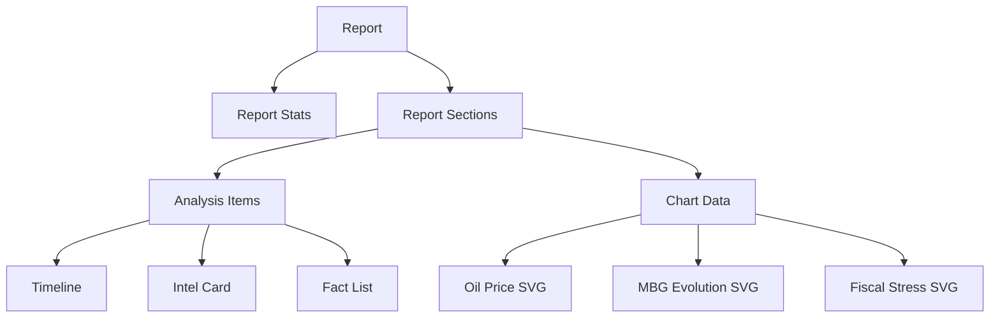

# AKOM (Intelligence Reporting System) — High-Fidelity Edition

[](https://laravel.com)
[](https://vuejs.org)
[](https://tailwindcss.com)
[](https://www.postgresql.org)

**AKOM** adalah platform pelaporan intelijen ekonomi *high-fidelity* yang menggabungkan kekuatan backend Laravel 13 dengan fleksibilitas Vue 3 (Inertia.js). Sistem ini dirancang khusus untuk menghasilkan laporan eksekutif premium dengan visualisasi data canggih dan keamanan distribusi berbasis UUID.

## ✨ Fitur & Kapabilitas Utama

### 🕵️ Intelligence Brief Viewer (Public)
Antarmuka publik yang dirancang dengan estetika "Intelligence Paper" yang sangat detail:
-   **Desain Premium**: Menggunakan palet warna HSL khusus, dark mode elegan, dan tipografi khusus (*Bebas Neue*, *IBM Plex Mono*, *Playfair Display*).
-   **Visualisasi SVG Dinamis**:
    -   **Oil Price Tracker**: Grafik garis interaktif yang membandingkan realita pasar vs asumsi APBN.
    -   **Fiscal Stress Bar**: Indikator tekanan defisit dengan sistem pewarnaan gradien dinamis.
    -   **MBG Evolution**: Grafik batang otomatis yang menunjukkan tren anggaran Badan Gizi Nasional.
-   **UUID Secure Link**: Distribusi laporan menggunakan tautan acak yang aman, memungkinkan stakeholder mengakses tanpa perlu login.

### 🎮 Admin Command Center (Dashboard)
Sistem manajemen konten tingkat lanjut untuk operasional intelijen:
-   **Full CRUD Suite**: Membuat, mengedit, dan menghapus laporan langsung melalui dashboard.
-   **Dynamic Form Engine**: Form bersarang (*nested forms*) yang memungkinkan Admin menambah/menghapus bab (sections), poin analisis (intel cards/timeline), dan modul statistik secara *real-time*.
-   **Role-Based Access**: Manajemen pengguna dengan level akses Superadmin dan Admin.

## 🏗 Struktur Arsitektur & Database



## 🛠 Tech Stack

-   **Backend**: Laravel 13 (Modern PHP 8.3+)
-   **Frontend**: Vue 3 + Inertia.js (Modern Monolith Approach)
-   **Styling**: Vanilla CSS + Tailwind CSS v4
-   **Database**: PostgreSQL
-   **Animations**: Intersection Observer + CSS Fade-ins

## 🚀 Panduan Instalasi Cepat

1.  **Persiapan Repositori**:
    ```bash
    git clone https://github.com/iwanharli/akom.git
    cd akom
    ```

2.  **Manajemen Dependensi**:
    ```bash
    composer install
    npm install
    ```

3.  **Pengaturan Environment**:
    Konfigurasikan `.env` untuk PostgreSQL:
    ```env
    DB_CONNECTION=pgsql
    DB_DATABASE=db_akom
    DB_USERNAME=postgres
    DB_PASSWORD=your_password
    ```

4.  **Inisialisasi Database (PENTING)**:
    Jalankan migrasi dan seeder untuk mendapatkan contoh laporan "Di Tepi Badai":
    ```bash
    php artisan migrate:fresh --seed
    ```

5.  **Kompilasi Visual & Server**:
    ```bash
    npm run build
    php artisan serve
    ```

## 🔐 Akses Default

-   **Login URL**: `/login`
-   **Default Password**: `password`
-   **User**: `superadmin@example.com` (Superadmin) / `admin@example.com` (Admin)

---
© 2026 AKOM Intelligence. Build for high-fidelity reporting.
